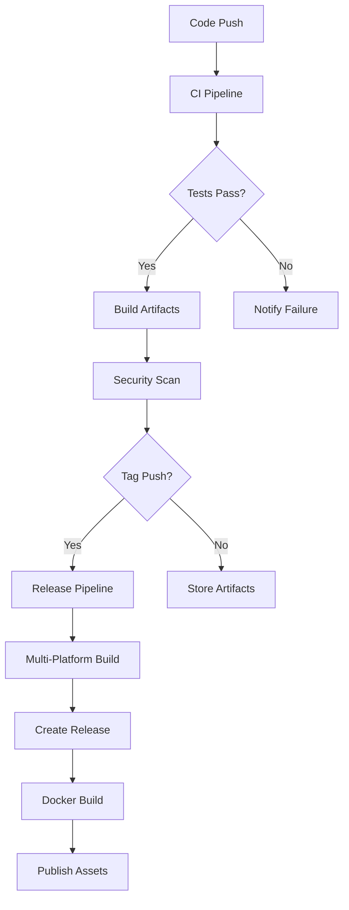

<div align="center">

# 🚀 Minecraft Mod Manager - Deployment Guide

**Complete guide for deploying, releasing, and distributing the Minecraft Mod Manager**

[🏠 Back to README](README.md) • [📚 Usage Guide](USAGE_GUIDE.md) • [🏗️ Project Structure](PROJECT_STRUCTURE.md)

</div>

---

## 📋 Table of Contents

- [🔄 CI/CD Pipeline](#-cicd-pipeline)
- [📦 Release Process](#-release-process)
- [🐳 Docker Deployment](#-docker-deployment)
- [📱 Installation Methods](#-installation-methods)
- [🌍 Distribution Strategy](#-distribution-strategy)
- [📊 Monitoring & Analytics](#-monitoring--analytics)
- [🔐 Security & Compliance](#-security--compliance)
- [⚡ Performance Optimization](#-performance-optimization)

---

## 🔄 CI/CD Pipeline

### GitHub Actions Workflows

<table>
<tr>
<td width="50%">

#### 🧪 **Continuous Integration** (`.github/workflows/ci.yml`)

**Triggers:**
- Push to `main` or `develop` branches
- Pull requests to `main`

**Actions:**
- ✅ Run comprehensive tests
- ✅ Lint code with golangci-lint
- ✅ Build for multiple platforms
- ✅ Security scanning
- ✅ Code coverage reporting

</td>
<td width="50%">

#### 🚀 **Release Pipeline** (`.github/workflows/release.yml`)

**Triggers:**
- Git tags matching `v*` pattern
- Manual workflow dispatch

**Actions:**
- 🔨 Build binaries for all platforms
- 📦 Create GitHub releases
- 🐳 Build and push Docker images
- 📝 Generate release notes
- 🔐 Create checksums

</td>
</tr>
</table>

### Pipeline Architecture



### Quality Gates

<details>
<summary><b>🔍 Code Quality Checks</b></summary>

**Linting Configuration (`.golangci.yml`):**
```yaml
linters:
  enable:
    - bodyclose      # Check HTTP response body closure
    - deadcode       # Find unused code
    - errcheck       # Check error handling
    - gosec          # Security audit
    - govet          # Go vet analysis
    - ineffassign    # Detect ineffectual assignments
    - staticcheck    # Advanced static analysis
    - unused         # Find unused constants, variables, functions
```

**Test Coverage Requirements:**
- Minimum 80% code coverage
- All critical paths tested
- Integration tests for API interactions
- Performance benchmarks

**Security Scanning:**
- Dependency vulnerability scanning
- Static code analysis for security issues
- Container image security scanning
- License compliance checking

</details>

<details>
<summary><b>🏗️ Build Matrix</b></summary>

**Supported Platforms:**

| OS | Architecture | Status | Notes |
|----|-------------|--------|-------|
| **Linux** | amd64 | ✅ Primary | Most common server platform |
| **Linux** | arm64 | ✅ Supported | Raspberry Pi, ARM servers |
| **macOS** | amd64 | ✅ Supported | Intel Macs |
| **macOS** | arm64 | ✅ Supported | Apple Silicon (M1/M2) |
| **Windows** | amd64 | ❌ Not Supported | Server management requires Unix tools |

**Build Optimization:**
- Cross-compilation for all platforms
- Static linking for portability
- Binary size optimization
- Debug symbol stripping

</details>

---

## 📦 Release Process

### Automated Release Creation

<details>
<summary><b>🏷️ Version Tagging Strategy</b></summary>

**Semantic Versioning (SemVer):**
- **MAJOR.MINOR.PATCH** (e.g., `v2.1.0`)
- **MAJOR**: Breaking changes
- **MINOR**: New features, backward compatible
- **PATCH**: Bug fixes, backward compatible

**Release Types:**
```bash
# Patch release (bug fixes)
git tag -a v2.0.1 -m "Fix server restart timeout issue"

# Minor release (new features)
git tag -a v2.1.0 -m "Add CurseForge integration"

# Major release (breaking changes)
git tag -a v3.0.0 -m "New configuration format"
```

**Pre-release Versions:**
```bash
# Alpha releases
git tag -a v2.1.0-alpha.1 -m "Alpha release for testing"

# Beta releases
git tag -a v2.1.0-beta.1 -m "Beta release candidate"

# Release candidates
git tag -a v2.1.0-rc.1 -m "Release candidate"
```

</details>

<details>
<summary><b>🚀 Release Workflow</b></summary>

**Method 1: Git Tag (Recommended)**
```bash
# Create and push tag
git tag -a v2.0.0 -m "Release v2.0.0: Enhanced mod management"
git push origin v2.0.0
```

**Method 2: Manual Dispatch**
1. Navigate to GitHub Actions tab
2. Select "Build and Release" workflow
3. Click "Run workflow"
4. Enter tag name (e.g., `v2.0.0`)
5. Click "Run workflow"

**Automated Release Assets:**
- ✅ Multi-platform binaries
- ✅ Checksums file (`checksums.txt`)
- ✅ Auto-generated release notes
- ✅ Installation instructions
- ✅ Docker images

</details>

<details>
<summary><b>📝 Release Notes Generation</b></summary>

**Auto-Generated Content:**
- 🎯 Installation instructions for all platforms
- 📋 Binary compatibility table
- 🚀 Quick start guide
- 🔧 Configuration examples
- ✅ Verification steps

**Example Release Notes:**
```markdown
# Minecraft Mod Manager v2.0.0

## 🚀 Installation

### Quick Install (Linux/macOS)
curl -sSL https://raw.githubusercontent.com/dacrab/craftops/main/install.sh | bash

## 📦 Available Binaries

| Platform | Architecture | Binary |
|----------|-------------|---------|
| Linux | x64 | craftops-linux-amd64 |
| Linux | ARM64 | craftops-linux-arm64 |
| macOS | x64 | craftops-darwin-amd64 |
| macOS | ARM64 | craftops-darwin-arm64 |

## 🎮 Quick Start
mmu init-config
mmu health-check
mmu update-mods
```

</details>

---

## 🐳 Docker Deployment

### Multi-Stage Build Process

<details>
<summary><b>🏗️ Dockerfile Architecture</b></summary>

**Stage 1: Builder**
```dockerfile
FROM golang:1.21-alpine AS builder
ENV CGO_ENABLED=0 GOOS=linux GOARCH=amd64

# Install build dependencies
RUN apk add --no-cache git ca-certificates tzdata

# Build application
WORKDIR /app
COPY go.mod go.sum ./
RUN go mod download
COPY . .
RUN go build -trimpath -ldflags "-X main.Version=2.0.0 -s -w" \
    -o craftops ./cmd/craftops
```

**Stage 2: Runtime**
```dockerfile
FROM alpine:latest

# Install runtime dependencies
RUN apk add --no-cache screen openjdk17-jre-headless curl ca-certificates tzdata

# Create non-root user
RUN addgroup -g 1000 minecraft && \
    adduser -u 1000 -G minecraft -s /bin/sh -D minecraft

# Copy binary and set up directories
COPY --from=builder /app/craftops /usr/local/bin/
RUN mkdir -p /minecraft/{server,mods,backups} /config /logs && \
    chown -R minecraft:minecraft /minecraft /config /logs
```

</details>

<details>
<summary><b>🚀 Container Registry</b></summary>

**GitHub Container Registry:**
- **Registry**: `ghcr.io/dacrab/craftops`
- **Tags**: `latest`, `v2.0.0`, `v2.0`, `v2`
- **Multi-architecture**: `linux/amd64`, `linux/arm64`

**Image Variants:**
```bash
# Latest stable release
docker pull ghcr.io/dacrab/craftops:latest

# Specific version
docker pull ghcr.io/dacrab/craftops:v2.0.0

# Development builds
docker pull ghcr.io/dacrab/craftops:develop
```

**Image Security:**
- ✅ Non-root user execution
- ✅ Minimal base image (Alpine Linux)
- ✅ No unnecessary packages
- ✅ Security scanning in CI
- ✅ Signed images (future)

</details>

<details>
<summary><b>🔧 Container Usage</b></summary>

**Basic Usage:**
```bash
# Help and version
docker run --rm ghcr.io/dacrab/craftops:latest --help
docker run --rm ghcr.io/dacrab/craftops:latest --version
```

**Production Deployment:**
```bash
# With persistent volumes
docker run -d \
  --name craftops \
  --restart unless-stopped \
  -v /host/minecraft/server:/minecraft/server \
  -v /host/minecraft/config:/config \
  -v /host/minecraft/backups:/minecraft/backups \
  -v /host/minecraft/logs:/logs \
  ghcr.io/dacrab/craftops:latest \
  update-mods
```

**Docker Compose:**
```yaml
version: '3.8'
services:
  craftops:
    image: ghcr.io/dacrab/craftops:latest
    container_name: craftops
    restart: unless-stopped
    volumes:
      - ./server:/minecraft/server
      - ./config:/config
      - ./backups:/minecraft/backups
      - ./logs:/logs
    command: ["update-mods"]
    healthcheck:
      test: ["CMD", "craftops", "health-check"]
      interval: 30s
      timeout: 10s
      retries: 3
```

</details>

---

## 📱 Installation Methods

### User-Friendly Installation

<details>
<summary><b>🎯 One-Line Install Script</b></summary>

**Installation Script Features:**
- 🔍 **Platform Detection**: Auto-detects OS and architecture
- 📥 **Latest Release**: Always downloads the newest version
- 🔗 **Alias Creation**: Sets up convenient command aliases
- ⚙️ **Configuration**: Creates default config file
- 🛣️ **PATH Management**: Adds binary to PATH automatically

**Script Workflow:**
```bash
curl -sSL https://raw.githubusercontent.com/dacrab/craftops/main/install.sh | bash
```

**What the Script Does:**
1. Detects platform (Linux/macOS, x64/ARM64)
2. Downloads appropriate binary from GitHub releases
3. Installs to `/usr/local/bin` (system) or `~/.local/bin` (user)
4. Creates aliases: `mmu`, `minecraft-mod-updater`
5. Sets up configuration directory
6. Creates default configuration file
7. Verifies installation

</details>

<details>
<summary><b>📦 Package Manager Integration</b></summary>

**Future Package Manager Support:**

| Package Manager | Platform | Status | Command |
|----------------|----------|--------|---------|
| **APT** | Debian/Ubuntu | 🔄 Planned | `apt install craftops` |
| **YUM/DNF** | RHEL/Fedora | 🔄 Planned | `dnf install craftops` |
| **Homebrew** | macOS/Linux | 🔄 Planned | `brew install craftops` |
| **Snap** | Universal | 🔄 Planned | `snap install craftops` |
| **AUR** | Arch Linux | 🔄 Planned | `yay -S craftops` |

**Current Manual Methods:**
```bash
# Direct download
curl -L https://github.com/dacrab/craftops/releases/latest/download/craftops-linux-amd64 -o mmu
chmod +x mmu && sudo mv mmu /usr/local/bin/

# From source
git clone https://github.com/dacrab/craftops.git
cd craftops && make install-system
```

</details>

<details>
<summary><b>🔧 Enterprise Deployment</b></summary>

**Ansible Playbook:**
```yaml
---
- name: Deploy Minecraft Mod Manager
  hosts: minecraft_servers
  become: yes
  vars:
    mmu_version: "v2.0.0"
    mmu_user: "minecraft"
    
  tasks:
    - name: Create minecraft user
      user:
        name: "{{ mmu_user }}"
        system: yes
        home: "/home/{{ mmu_user }}"
        shell: /bin/bash
        
    - name: Download MMU binary
      get_url:
        url: "https://github.com/dacrab/craftops/releases/download/{{ mmu_version }}/craftops-linux-amd64"
        dest: "/usr/local/bin/craftops"
        mode: '0755'
        
    - name: Create aliases
      file:
        src: "/usr/local/bin/craftops"
        dest: "/usr/local/bin/{{ item }}"
        state: link
      loop:
        - mmu
        - minecraft-mod-updater
        
    - name: Deploy configuration
      template:
        src: config.toml.j2
        dest: "/home/{{ mmu_user }}/.config/craftops/config.toml"
        owner: "{{ mmu_user }}"
        group: "{{ mmu_user }}"
        mode: '0600'
```

**Terraform Module:**
```hcl
module "minecraft_mod_manager" {
  source = "./modules/craftops"
  
  servers = [
    {
      host = "minecraft-1.example.com"
      user = "minecraft"
      config = {
        minecraft_version = "1.20.1"
        modloader = "fabric"
        discord_webhook = var.discord_webhook
      }
    }
  ]
}
```

</details>

---

## 🌍 Distribution Strategy

### Release Channels

<details>
<summary><b>📢 Distribution Channels</b></summary>

**Primary Channels:**
1. **GitHub Releases** - Main distribution point
2. **GitHub Container Registry** - Docker images
3. **Installation Script** - One-line install
4. **Documentation** - Comprehensive guides

**Future Channels:**
- Package repositories (APT, YUM, Homebrew)
- Container registries (Docker Hub, Quay.io)
- Cloud marketplaces (AWS, Azure, GCP)
- Configuration management (Ansible Galaxy, Puppet Forge)

</details>

<details>
<summary><b>🎯 Target Audiences</b></summary>

**Primary Users:**
- **Server Administrators** - Managing production Minecraft servers
- **Hosting Providers** - Offering managed Minecraft hosting
- **Community Servers** - Running servers for gaming communities
- **Development Teams** - Testing mod compatibility

**Use Cases:**
- **Automated Updates** - Keep mods current without manual intervention
- **Server Management** - Streamline server lifecycle operations
- **Backup Management** - Ensure data safety with automated backups
- **Notification Systems** - Keep players informed of maintenance

</details>

<details>
<summary><b>📊 Adoption Metrics</b></summary>

**Key Performance Indicators:**
- **Download Counts** - GitHub release downloads
- **Container Pulls** - Docker image pull statistics
- **GitHub Stars** - Community interest and adoption
- **Issue Activity** - User engagement and feedback
- **Documentation Views** - User education and onboarding

**Analytics Tracking:**
```bash
# GitHub API for release statistics
curl -s https://api.github.com/repos/dacrab/craftops/releases/latest | \
  jq '.assets[] | {name: .name, downloads: .download_count}'

# Container registry statistics
docker run --rm -it ghcr.io/dacrab/craftops:latest --version
```

</details>

---

## 📊 Monitoring & Analytics

### Release Monitoring

<details>
<summary><b>📈 Release Analytics</b></summary>

**GitHub Release Metrics:**
- Download counts per platform
- Release adoption rates
- Geographic distribution
- Version usage statistics

**Container Registry Metrics:**
- Image pull counts
- Platform distribution (amd64 vs arm64)
- Version popularity
- Registry performance

**User Feedback Channels:**
- GitHub Issues for bug reports
- GitHub Discussions for questions
- Discord community (future)
- Documentation feedback

</details>

<details>
<summary><b>🔍 Performance Monitoring</b></summary>

**Application Metrics:**
- Startup time measurement
- Memory usage profiling
- API response times
- Error rates and types

**Infrastructure Metrics:**
- CI/CD pipeline performance
- Build times and success rates
- Container registry availability
- CDN performance for downloads

**Monitoring Tools:**
```bash
# Performance profiling
go tool pprof http://localhost:6060/debug/pprof/profile

# Memory analysis
go tool pprof http://localhost:6060/debug/pprof/heap

# Trace analysis
go tool trace trace.out
```

</details>

---

## 🔐 Security & Compliance

### Security Measures

<details>
<summary><b>🛡️ Supply Chain Security</b></summary>

**Build Security:**
- ✅ Reproducible builds
- ✅ Dependency scanning
- ✅ Static code analysis
- ✅ Container image scanning
- ✅ Binary signing (planned)

**Distribution Security:**
- ✅ HTTPS for all downloads
- ✅ Checksums for verification
- ✅ GPG signatures (planned)
- ✅ Secure container registry
- ✅ Vulnerability disclosure process

**Runtime Security:**
- ✅ Non-root execution
- ✅ Minimal attack surface
- ✅ Secure defaults
- ✅ Input validation
- ✅ Error handling

</details>

<details>
<summary><b>🔒 Compliance & Auditing</b></summary>

**License Compliance:**
- MIT License for maximum compatibility
- Dependency license scanning
- SBOM (Software Bill of Materials) generation
- License compatibility verification

**Security Auditing:**
- Regular dependency updates
- Automated vulnerability scanning
- Security-focused code reviews
- Penetration testing (planned)

**Privacy Considerations:**
- No telemetry collection
- Local configuration storage
- Optional external communications
- User consent for notifications

</details>

---

## ⚡ Performance Optimization

### Build Optimization

<details>
<summary><b>🚀 Binary Optimization</b></summary>

**Build Flags:**
```bash
# Optimized build command
go build -trimpath -ldflags "-X main.Version=2.0.0 -s -w" \
  -o craftops ./cmd/craftops
```

**Optimization Techniques:**
- **`-trimpath`**: Remove file system paths from binary
- **`-s`**: Strip symbol table and debug info
- **`-w`**: Strip DWARF debug info
- **Static linking**: Reduce runtime dependencies
- **Dead code elimination**: Remove unused code

**Size Comparison:**
| Build Type | Size | Notes |
|------------|------|-------|
| **Debug** | ~25MB | Full debug info |
| **Standard** | ~15MB | Basic optimization |
| **Optimized** | ~8MB | Full optimization |
| **UPX Compressed** | ~3MB | Additional compression |

</details>

<details>
<summary><b>📦 Distribution Optimization</b></summary>

**Download Optimization:**
- Compressed binaries
- CDN distribution (GitHub)
- Parallel downloads
- Resume capability
- Bandwidth optimization

**Container Optimization:**
- Multi-stage builds
- Minimal base images
- Layer caching
- Image compression
- Registry optimization

**Installation Speed:**
```bash
# Benchmark installation script
time curl -sSL https://raw.githubusercontent.com/dacrab/craftops/main/install.sh | bash

# Typical results:
# real    0m15.234s  (including download)
# user    0m2.145s
# sys     0m1.023s
```

</details>

---

## 🎯 Future Roadmap

### Planned Enhancements

<details>
<summary><b>🔮 Version 2.1.0 - Extended Platform Support</b></summary>

**New Features:**
- **CurseForge Integration** - Full API support
- **GitHub Releases** - Direct mod downloads from GitHub
- **Windows Support** - PowerShell-based server management
- **Web Interface** - Optional web UI for management

**Technical Improvements:**
- Enhanced error handling
- Improved logging and diagnostics
- Performance optimizations
- Extended configuration options

</details>

<details>
<summary><b>🚀 Version 2.2.0 - Enterprise Features</b></summary>

**Enterprise Capabilities:**
- **Multi-Server Management** - Manage multiple servers
- **Role-Based Access** - User permissions and roles
- **Audit Logging** - Comprehensive operation logs
- **API Endpoints** - REST API for integration

**Monitoring & Observability:**
- Prometheus metrics
- Health check endpoints
- Performance dashboards
- Alert integrations

</details>

<details>
<summary><b>🌟 Version 3.0.0 - Platform Evolution</b></summary>

**Platform Features:**
- **Plugin System** - Extensible architecture
- **Marketplace** - Community plugins and themes
- **Cloud Integration** - AWS, Azure, GCP support
- **Kubernetes Operator** - Native K8s deployment

**Advanced Capabilities:**
- Machine learning for optimization
- Predictive maintenance
- Advanced analytics
- Global CDN distribution

</details>

---

<div align="center">

**🚀 Ready to Deploy!**

This deployment guide ensures reliable, secure, and scalable distribution of the Minecraft Mod Manager across all supported platforms.

[🏠 Back to README](README.md) • [📚 Usage Guide](USAGE_GUIDE.md) • [🏗️ Project Structure](PROJECT_STRUCTURE.md)

---

*For the latest deployment information and updates, visit the [GitHub repository](https://github.com/dacrab/craftops).*

</div>